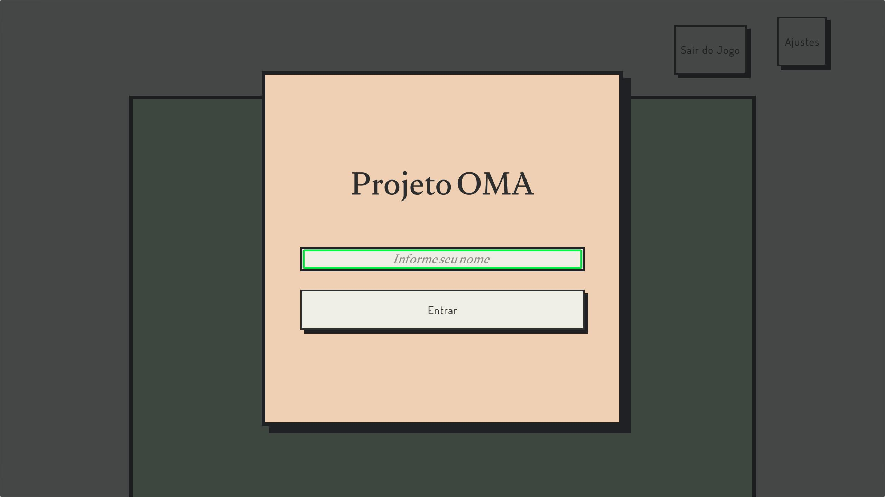

# Como Funciona

Esta seção demonstra uma explicação tela-a-tela do Player ENA para demonstrar seu funcionamento. Para mais detalhes sobre controles, ver [Controles](../Controles.md).

# Menu

Para começar, a aplicação pede o nome do usuário para iniciar o perfil da sessão a ser usado pelo jogador. Por padrão, as configurações de acessibilidade já estão ativas para permitir a navegação por pessoas com deficiência visual.

<aside>
ℹ️ No momento, o perfil da sessão é apenas um perfil temporário enquanto a aplicação está ativa.

</aside>

Início de Sessão

Ao abrir o menu principal, o sistema busca pelos mapas disponíveis para salvar localmente e exibe-os abaixo. Aqui também é possível ver o nome do usuário definido para a sessão na parte superior esquerda da tela, assim como acessar botões de configuração e sair do jogo.

Menu Principal

No menu de configurações, é possível ajustar funcionalidades de jogo. Todas as configurações estão detalhadas na página falando sobre [Persistência](../Persist%C3%AAncia.md).

Ajustes do Jogo

Ao selecionar um mapa, você é encaminhado para a tela abaixo, que mostra um *preview* do mapa (para auxiliar o professor), o nome do mapa e botões para confirmar a escolha do mapa e iniciar a atividade ou cancelar.

Mapa Selecionado

# Gameplay

<aside>
ℹ️ Para mais detalhes sobre como controlar o personagem, ver Controles.

</aside>

Após selecionar o mapa, o sistema dará as instruções de voz para o jogador indicando os objetivos a serem encontrados. Caso o minimapa esteja habilitado, o mesmo aparecerá na parte superior esquerda da tela. A partir deste momento, o jogador poderá se mover usando o joystick para navegar o mapa ou receber instruções.

A lista de objetivos deve ser completada em ordem até todos os objetos serem encontrados: ao cumprir esta missão, o jogador deve voltar ao ponto de partida para terminar a atividade com sucesso. Para completar um objetivo, o jogador deve colidir com o objeto interativo a ser encontrado, seguindo a ordem destacada pelas instruções. Em caso de dúvida, o jogador pode pedir uma dica, o que indicará qual o próximo objeto a ser encontrado.

Jogabilidade

A qualquer momento, o jogador pode pausar e sair do jogo, retornando ao menu principal com a atividade incompleta. Independente do resultado, o jogo salva as informações da sessão em um log de mensagens e a trilha percorrida pelo jogador. Para mais detalhes sobre as informações coletadas, ver [Métricas](../M%C3%A9tricas/M%C3%A9tricas.md).